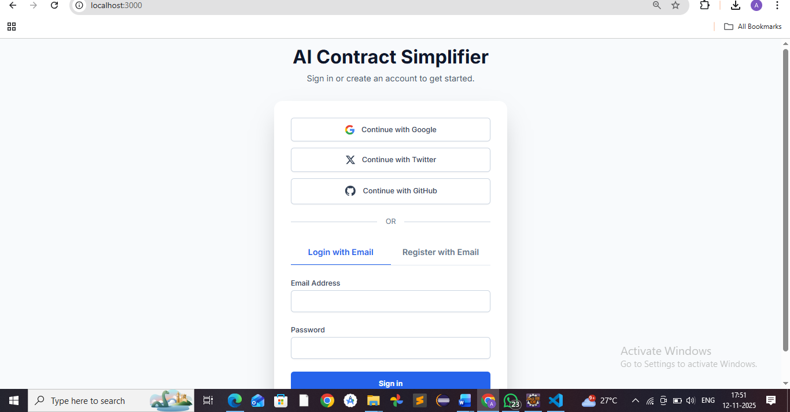
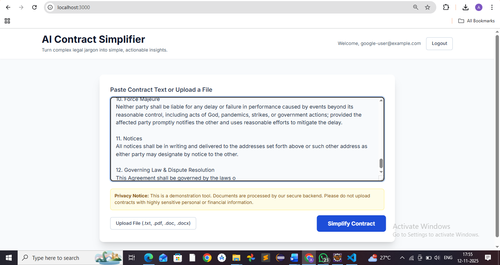
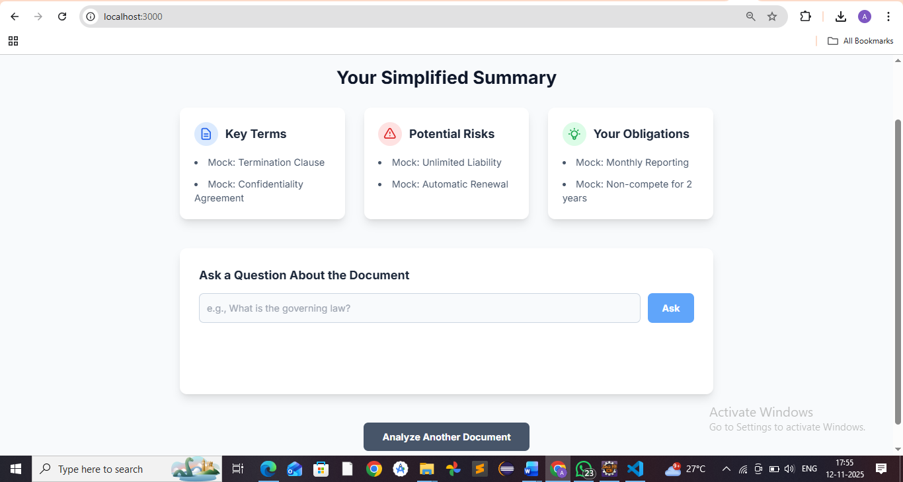

# ⚖️ AI Contract Simplifier

<div align="center">
  <!-- It's highly recommended to add a project logo or banner here! -->
  <!-- Example:  -->
  <h1>AI Contract Simplifier</h1>
  <strong>Turn complex legal jargon into simple, actionable insights with the power of AI.</strong>
</div>

---

<p align="center">
  <!-- Status Badges -->
  
  
  <!-- Tech Stack Badges -->
  
  
  
  
  <!-- Contribution Badges -->
  <a href="https://github.com/your-username/ai-contract-simplifier/issues">
    
  </a>
   <a href="https://github.com/your-username/ai-contract-simplifier/pulls">
    
  </a>
</p>

## The Problem

Legal documents are dense, full of complex jargon, and difficult for non-lawyers to understand. Reading a contract can be intimidating, and missing a key detail can lead to significant financial or legal risk. Small businesses, freelancers, and individuals often lack the resources to hire a lawyer for every document they sign.

## The Solution

**AI Contract Simplifier** is a web application that bridges this gap. It leverages cutting-edge AI to analyze legal texts and present them in a clean, digestible format. Simply upload your contract, and the AI will highlight key terms, identify potential risks, and list your obligations in plain English.

---

## 🎯 Who Is This For?

This tool is designed for:
-   **Freelancers & Consultants** reviewing client contracts.
-   **Small Business Owners** signing agreements with vendors or partners.
-   **Landlords & Tenants** trying to understand lease agreements.
-   **Students & Individuals** facing terms of service or employment contracts.
-   Anyone who wants to be more informed before signing a legal document.

---

## ✨ Key Features

-   **🤖 AI-Powered Analysis**: Uses advanced AI models to parse and understand complex legal language.
-   **🔑 Key Term Extraction**: Automatically identifies and explains the most important terms and clauses.
-   **⚠️ Risk Detection**: Flags potentially unfavorable clauses, hidden risks, and areas that need close attention.
-   **📋 Obligation Summary**: Provides a clear, actionable checklist of your responsibilities under the contract.
-   **❓ Interactive Q&A**: Ask specific questions about your document (e.g., "What is the governing law?") and get instant answers.
-   **📄 Multi-Format Support**: Upload contracts in various formats, including `.txt`, `.pdf`, and `.docx`.
-   **🔐 Secure & Private**: Your documents are processed securely. (Note: This is a demo; avoid highly sensitive data).
-   **📱 Modern & Responsive UI**: Clean, intuitive, and accessible interface that works on any device.

---

## 🚀 Live Demo & Screenshots

A picture is worth a thousand words. Here's the app in action:

*(This is the most important part of a README! It's highly recommended to record a short GIF of the app's workflow and add it here.)*

Open [http://localhost:5173](http://localhost:3000/)

| Login Screen | File Upload | Summary View |
| :---: | :---: | :---: |
|  | |  |

---

## 🛠️ Tech Stack & Architecture

This project is designed as a modern full-stack application, combining a dynamic React frontend with a robust Java-based backend.

| Layer | Technology |
| :--- | :--- |
| **Frontend** | React, TypeScript, TailwindCSS, Vite |
| **Backend** | Spring Boot (REST + MVC + Security) |
| **AI/NLP** | Gemini API (via Backend) |
| **Database** | PostgreSQL / MySQL (via JPA + Hibernate) |
| **File Parsing** | Apache Tika / PDFBox |
| **Authentication** | Spring Security + JWT |

### System Architecture

The application follows a decoupled, service-oriented architecture. The React frontend is a standalone Single-Page Application (SPA) that interacts with the Spring Boot backend through a secure REST API. This ensures a clean separation of concerns and allows for independent scaling.

mermaid
graph TD

    subgraph "Client-Side (Vercel/Netlify)"
        B
    end

    subgraph "Server-Side (AWS/Render)"
        C
        D
        E
        F
    end

    style B fill:#61DAFB,stroke:#333,stroke-width:2px
    style C fill:#6DB33F,stroke:#333,stroke-width:2px
    style D fill:#336791,stroke:#333,stroke-width:2px
    style E fill:#4285F4,stroke:#333,stroke-width:2px


---


## ⚙️ Getting Started (Frontend)

To get a local copy of the frontend up and running, follow these simple steps.

### Prerequisites

-   Node.js (v18 or higher)
-   npm or yarn

### Installation

1.  **Clone the repo:**
    ```sh
    git clone https://github.com/your-username/ai-contract-simplifier.git
    ```
2.  **Navigate to the project directory:**
    ```sh
    cd ai-contract-simplifier
    ```
3.  **Install NPM packages:**
    ```sh
    npm install
    ```
4.  **Run the development server:**
    ```sh
    npm run dev
    ```


> **Note:** The application is currently running in a mocked-backend mode. All API calls are simulated with a delay to mimic a real network environment. To connect to a real backend, update the API endpoints in `src/services/geminiService.ts`.

---

## 🗺️ Roadmap

We have a clear vision for making this tool even more powerful. Here are some features we're planning:

-   [ ] **User Dashboards**: Save and manage all your analyzed contracts.
-   [ ] **Version History**: Compare different versions of a contract to see what's changed.
-   [ ] **Team Collaboration**: Share and discuss contract summaries with team members.
-   [ ] **Advanced Clause Library**: Build a library of standard vs. non-standard clauses for better risk assessment.
-   [ ] **Multi-Language Support**: Analyze contracts in languages other than English.

---

## 🤝 How to Contribute

Contributions of all kinds are welcome! Whether you're a developer, a designer, or a legal professional with feedback, we'd love to hear from you.

1.  **Fork the repository.**
2.  **Create a new branch** (`git checkout -b feature/AmazingFeature`).
3.  **Commit your changes** (`git commit -m 'Add some AmazingFeature'`).
4.  **Push to the branch** (`git push origin feature/AmazingFeature`).
5.  **Open a Pull Request.**


## 📄 License

This project is licensed under the MIT License. See the `LICENSE` file for details.

---

<div align="center">
Made with ❤️ by Afia 
</div>
